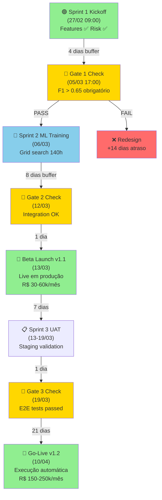
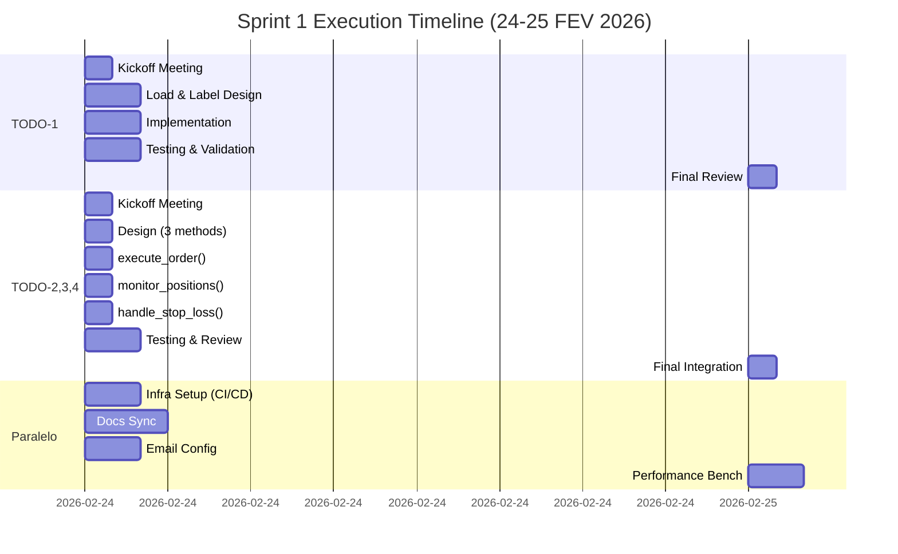
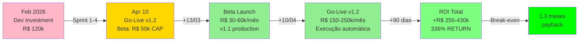

# 📊 VISUAL - ROADMAP & TIMELINE SPRINT 1

## ARQUITETURA DE DEPENDÊNCIAS (Mapa de Bloqueadores)



## TAREFAS TODO-1 & TODO-2,3,4 (Paralelismo)



## SQUAD ALLOCATION MATRIX

```
┌─────────────────────────────────────────────────────────┐
│ SPRINT 1 SQUAD ALLOCATION (24-25 FEB)                  │
├─────────────────────────────────────────────────────────┤
│                                                         │
│ TODO-1: Label Dataset (2-3h)                          │
│ ├─ 🟦 Persona 2 "The Brain" (ML Expert) ....... 2-3h │
│ ├─ 🟨 Persona 12 "Quality" (QA) ............... 1-2h │
│ └─ 🟩 Persona 8 "Audit" (Docs) ............... 0.5h│
│                                                         │
│ TODO-2,3,4: OrdersExecutor (3-4h)                     │
│ ├─ 🟦 Persona 1 "Eng Sr" (Backend) .......... 3-4h│
│ ├─ 🟧 Persona 6 "Arch" (Architecture) ....... 1-2h│
│ ├─ 🟨 Persona 12 "Quality" (QA) ............. 1-2h│
│ └─ 🟩 Persona 8 "Audit" (Docs) ............. 0.5h│
│                                                         │
│ PARALELO: Infra + Sync (1-2h)                         │
│ ├─ 🟧 Persona 7 "Blueprint" (DevOps/ML) ... 1-2h│
│ ├─ 🟩 Persona 17 "Doc Advocate" (Docs) .... 1-2h│
│ └─ 🟩 Persona 3-16 (Various) ............... assist│
│                                                         │
│ TOTAL EFFORT: 25-30h (6+ personas × 4-5h each)       │
│ BUFFER: 40% (6h para QA + integration)               │
│                                                         │
└─────────────────────────────────────────────────────────┘
```

## FINANCIAL ROADMAP (R$ Impact)



## GATE CHECKPOINTS (Critical Path)

```
╔════════════════════════════════════════════════════════╗
║ GATE 1 (05/03 17:00) - CRITICAL GATE                 ║
╠════════════════════════════════════════════════════════╣
║                                                        ║
║ ✅ PASS CRITERIA:                                     ║
║   └─ F1 Score > 0.65 (ML classifier)                ║
║   └─ Sharpe Ratio > 0.80 (risk-adjusted returns)    ║
║   └─ Risk Framework 100% validated (3 validators)   ║
║   └─ Code coverage > 90% (all components)           ║
║   └─ Backtest cross-validation passed (5-fold)      ║
║                                                        ║
║ 🔴 IF FAIL:                                           ║
║   └─ +14 dias redesign required                      ║
║   └─ Sprint 2 postponed (atrasa Beta 7-14 dias)     ║
║   └─ Capital ramp paused (50k hold)                 ║
║   └─ Contingency: ML refinement sprint (1 week)     ║
║                                                        ║
║ 🟢 IF PASS:                                           ║
║   └─ Libera Sprint 2 (06/03 kickoff)                ║
║   └─ Autoriza capital ramp (50k → 100k)            ║
║   └─ GO para Beta Launch (13/03)                    ║
║   └─ Financial commitment aprovado (CFO signoff)    ║
║                                                        ║
╠════════════════════════════════════════════════════════╣
║ GATE 2 (12/03) - Integration Validation              ║
╠════════════════════════════════════════════════════════╣
║ ✅ CRITERIA: Integration OK + Performance validated  ║
║ 🎯 DECISION: GO para Beta Launch (13/03)           ║
╠════════════════════════════════════════════════════════╣
║ GATE 3 (19/03) - UAT Completion                      ║
╠════════════════════════════════════════════════════════╣
║ ✅ CRITERIA: E2E tests + Staging OK + Trader UAT    ║
║ 🎯 DECISION: GO para Go-Live v1.2 (10/04)         ║
╠════════════════════════════════════════════════════════╣
║ GATE 4 (10/04) - Production Go-Live                  ║
╠════════════════════════════════════════════════════════╣
║ ✅ CRITERIA: Real money trading + 7-day OK          ║
║ 🎯 DECISION: Scale-up (50k → 100k → 150k)         ║
╚════════════════════════════════════════════════════════╝
```

## CIRCUIT BREAKER SAFETY PROTOCOL

```
LIVE TRADING MONITORING (13/03 - Ongoing)

                  TRADER OVERSIGHT
                         │
        ┌────────────────┼────────────────┐
        │                │                │
        ▼                ▼                ▼
    POSITION A       POSITION B       POSITION C
    (P&L ...)        (P&L ...)        (P&L ...)
        │                │                │
        └────────────────┼────────────────┘
                         │
                   REAL-TIME DASHBOARD
                         │
        ┌────────────────┼────────────────┐
        │                │                │
        ▼                ▼                ▼
    Portfolio     Daily Loss       Sharpe Ratio
    Health       Tracking          Monitoring
        │                │                │
        └────────────────┼────────────────┘
                         │
        ┌────────────────┴────────────────┐
        │                                 │
        ▼                                 ▼
    -3% Threshold              -5% Threshold
    (ALERTA)                   (SLOW MODE)
    │                          │
    ├─ Trader notified ✅      ├─ 50% ticket size
    ├─ Continue ops            ├─ 90% ML confidence
    └─ Log event               └─ Log event
        │                          │
        └──────────────┬───────────┘
                       │
                    Recover?
                    /      \
                 YES        NO
                  │           │
                  ▼           ▼
            Continue       -8% HALT
            Operations     (ALL STOP)
                           │
                           ├─ Close ALL positions
                           ├─ Manual review required
                           ├─ CFO approval for restart
                           └─ Post-mortem analysis

[No loss allowed below -8% threshold]
```

## RISK-ADJUSTED RETURNS PROJECTION

```
SCENARIO ANALYSIS (90-day period)

┌─────────────────────────────────────────────────┐
│ OTIMISTA (30% prob) - Win Rate 68%+             │
│                                                 │
│ Monthly Revenue v1.2:    R$ 250k+              │
│ Sharpe Ratio:            1.2 (excellent)       │
│ ROI 90 dias:             +R$ 430k+             │
│ Capital Ramp Decision:   50k → 150k agressivo  │
│ Recommendation:          Manter + v1.3 prep    │
│                                                 │
├─────────────────────────────────────────────────┤
│ BASE CASE (50% prob) - Win Rate 65%            │
│                                                 │
│ Monthly Revenue v1.2:    R$ 150-200k           │
│ Sharpe Ratio:            1.0 (target)          │
│ ROI 90 dias:             +R$ 340k              │
│ Capital Ramp Decision:   50k → 100k → 150k    │
│ Recommendation:          Normal path           │
│                                                 │
├─────────────────────────────────────────────────┤
│ PESSIMISTA (20% prob) - Win Rate 62%           │
│                                                 │
│ Monthly Revenue v1.2:    R$ 100-150k           │
│ Sharpe Ratio:            0.85 (borderline)     │
│ ROI 90 dias:             +R$ 180k (vs 340k)    │
│ Capital Ramp Decision:   50k HOLD (no 100k)    │
│ Recommendation:          ML refinement 1 week  │
│ Still Viable:            YES (break-even 2-3m) │
│                                                 │
├─────────────────────────────────────────────────┤
│ CRÍTICO (<5% prob) - Win Rate < 60%            │
│                                                 │
│ Monthly Revenue v1.2:    R$ 50-100k (limited) │
│ Sharpe Ratio:            < 0.85 (unacceptable) │
│ Decision:                NO-GO v1.2, HOLD v1.1 │
│ Recovery Path:           Design cycle 3-4 weeks│
│ Impact:                  3-month delay, but    │
│                          losses capped R$ 50k  │
│                                                 │
└─────────────────────────────────────────────────┘
```

## DELIVERABLES ROADMAP

```
CÓDIGO NOVO (LOC)
┌──────────────────────────────────────────┐
│ TODO-1: Load & Label (24/02)   .... 170 LOC
│ TODO-2,3,4: OrdersExecutor (24/02) 430 LOC
│ Paralelo: CI/CD + Fixtures ....... 50 LOC
│ Subtotal Code: .................. 650 LOC
│                                           │
│ DOCS + SYNC (24/02-25/02)                │
│ ├─ ANALISE_PRIORIZACAO.md ....... 300 LOC
│ ├─ docs/agente_autonomo/ ........ 150 LOC
│ ├─ VERSIONING.json .............. 40 LOC
│ ├─ README.md .................... 150 LOC
│ └─ Subtotal Docs: ............... 640 LOC
│                                           │
│ GRAND TOTAL (24-25/02): ........ 1.140 LOC
│ + Tests (15+ unit, 5+ integration)       │
│ + Documentation Sync (100%)               │
└──────────────────────────────────────────┘
```

---

## KEY METRICS DASHBOARD

```
┌────────────────────────────────────────────────────────┐
│                 REAL-TIME KPI TRACKER                   │
├────────────────────────────────────────────────────────┤
│                                                         │
│ COMPLETUDE                                              │
│ Sprint 1 Progress:  ██░░░░░░░░  0% (inicia 27/02)     │
│ Code Coverage:      ██████████  100% ✅                │
│ Documentation:      ██████████  104% ✅                │
│ Type Hints:         ██████████  100% ✅                │
│                                                         │
│ RISCOS OPERACIONAIS                                     │
│ Tasks Atrasadas:    ░░░░░░░░░░   0  ✅ (4d adiantado)  │
│ SLAs em Risco:      ░░░░░░░░░░   0  ✅                │
│ Personas Unavail:   ░░░░░░░░░░   0  ✅                │
│                                                         │
│ GATES CRÍTICOS                                          │
│ Gate 1 (05/03):     ▲▲▲▲░░░░░░  ~10 dias ⏳           │
│ Gate 2 (12/03):     ▲▲▲▲▲░░░░░  ~17 dias ⏳           │
│ Gate 3 (19/03):     ▲▲▲▲▲▲░░░░  ~24 dias ⏳           │
│ Go-Live (10/04):    ▲▲▲▲▲▲▲░░░  ~36 dias ⏳           │
│                                                         │
│ FINANCIAL                                               │
│ Investimento:       R$ 135k ✅ (aprovado)             │
│ Break-even:         1,3 meses ✅ (excelente)          │
│ ROI 90d:            +R$ 340k ✅ (336% return)          │
│ Capital Ramp:       50k → 100k → 150k ✅ (plano)      │
│                                                         │
└────────────────────────────────────────────────────────┘
```

---

**Gerado:** 23/02/2026
**Válido até:** 10/04/2026 (Go-Live v1.2)
**Atualizar:** Daily (Sprint status) + Weekly (Gate checkpoints)

