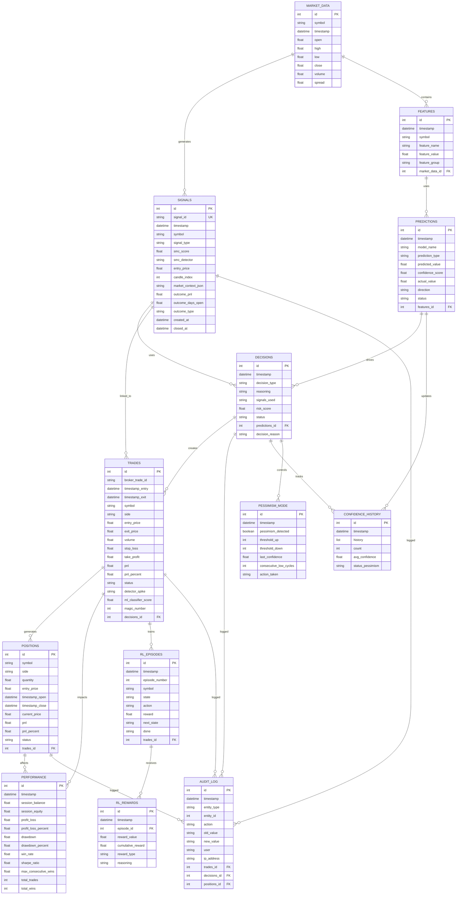

# Diagramas Canonicos

## Indice

- [Escopo de Execucao (4 Agentes)](#escopo-de-execucao-4-agentes)
- [Isolamento por Magic Number
  (EA ID)](#isolamento-por-magic-number-ea-id)
- [Visao de Fluxo - Gate 2](#visao-de-fluxo-gate-2)
- [Diagrama de Classes (Mermaid)](#diagrama-de-classes-mermaid)
- [Diagrama de Dados (ER - Mermaid)](#diagrama-de-dados-er-mermaid)
- [Visao de Dependencias](#visao-de-dependencias)
- [Notas](#notas)\n\n## Escopo de Execucao (4 Agentes)

Os diagramas canonicos servem exclusivamente para evoluir
estes executores:

| Agente | Launcher | Magic (EA ID) |
|---|---|---|
| Diários | `INICIAR_DIARIOS.bat` | 234800 (reservado) |
| Micro Tendência | `INICIAR_MICRO_TENDENCIA_AUTO_TRADE.bat` | 234700 |
| RL 5000 | `INICIAR_AGENTE_RL_5000.bat` | 234500 |
| RL Direto | `INICIAR_AGENTE_RL_DIRETO.bat` | 234600 |

## Isolamento por Magic Number (EA ID)

Cada agente possui um Magic Number fixo. Toda ordem enviada
ao MT5 carrega o magic do emissor. Toda consulta de posições
filtra pelo magic do agente corrente.

Referência: ADR-012 (`docs/ADRS.md`)

```text
+-----------------------------------------------------+
|                   MT5 Terminal (WIN$N)               |
+-----------------------------------------------------+
|  Posições: [magic=234500] [magic=234600] [magic=..] |
+-----+-------------------+-------------------+-------+
      |                   |                   |
      | positions_get     | positions_get     |
      | (magic=234500)    | (magic=234600)    |
      v                   v                   v
+----------+       +----------+       +----------+
| RL 5000  |       | RL Dir.  |       | Micro T. |
| m=234500 |       | m=234600 |       | m=234700 |
+----------+       +----------+       +----------+
|tickets_  |       |Agente    |       |monitor_  |
|proprios  |       |Posicao   |       |hedge_    |
|set[int]  |       |Status    |       |orphans() |
+----------+       +----------+       +----------+
     |                  |                  |
     v                  v                  v
+----------+       +----------+       +----------+
|posicao_  |       |posicao_  |       |Order(    |
|agente_   |       |agente_   |       | magic=   |
|5000.json |       |direto.   |       | 234700)  |
|          |       |json      |       |          |
+----------+       +----------+       +----------+
```

**3 Níveis de Isolamento:**

1. **MT5 Magic Number** — `Order.magic_number` na entidade,
   `MT5Adapter.send_order()` usa `order.magic_number`,
   `positions_get()` filtra por magic
2. **Session ID + JSON** — arquivo por agente
   (`outputs/agente_posicao_{session_id}.json`),
   `PosicaoIsoladaManager` valida ownership
3. **Memória de processo** — `MotorDecisaoIsolado`
   (RL 5000 + RL Direto), `PosicaoIsoladaManager`
   (RL Direto). Desde 17/03 usa módulos formais.

## Visao de Fluxo - Gate 2

```text
INICIAR_DIARIOS.bat
  -> run_p0_2_backtest.py (background)
    -> prepare_p0_2_mt5_dataset.py (se dataset/auditoria falhar)
    -> backtest_engine.py
    -> backtest_reporter.py
    -> backtest_validator.py
    -> data/backtest/{dataset_audit.json, backtest_results.json, gate2_decision.json, p0_2_status.json}

INICIAR_MICRO_TENDENCIA_AUTO_TRADE.bat
  -> check_p0_2_status.py
    -> CAPITAL_SCALE (100k ou 50k)
  -> launch_agent_with_ml_v1_2_3.py
    -> start_execution_monitor.py
      -> ExecutionMonitor
      -> WebSocket ATI-1 (ORDER_STATUS_UPDATE, POSITION_UPDATE, RISK_VIOLATION)

Etapa 4 (Manutencao Operacional)
  -> load_test_order_queue.py
    -> outputs/load_test_results_*.json
    -> outputs/memory_profile_*.json (opcional)
  -> cleanup_old_orders_scheduler.py
    -> outputs/cleanup_report_*.json
  -> BAT/AGENDA_LIMPEZA_DIARIA.bat (Task Scheduler 23:00)
```

## Diagrama de Classes (Mermaid)

```mermaid
classDiagram
    %% Learning Layer
    class IntraDayLearner {
        -rejection_patterns: Dict
        -session_start: datetime
        -hit_rate_history: Dict
        +record_rejection(reasons: List) void
        +validate_hold(pattern: str, acertou: bool) Tuple
        +get_current_adjustments() float
        +summary_with_actions() str
        +export_audit_log(filepath: str) void
    }

    %% Data Layer
    class SignalPersistence {
        -db_path: str
        -connection: sqlite3.Connection
        +insert(signal: Signal) bool
        +_serialize_market_context(context: MarketContext) str
        +_deserialize_market_context(json_str: str) MarketContext
        +_row_to_signal(row: sqlite3.Row) Signal
        +get_signals_by_symbol(symbol: str) List~Signal~
        +get_signals_by_date_range(start: datetime, end: datetime) List~Signal~
    }

    class MT5Adapter {
        -terminal_path: str
        -account_login: int
        -terminal_pid: int
        +_connect_mt5() bool
        +_validate_terminal_isolation() bool
        +_ensure_connected_with_isolation() bool
        +send_order(order: Order) str
        +get_positions() List~Position~
        +get_positions_by_magic(magic: int) List~Position~
        +close_position(symbol: str) bool
        +get_account_balance() float
    }

    class DataPipeline {
        -raw_data: RawMarketData
        -features: FeatureSet
        +load_market_data(symbol: str) void
        +process_candles(candles: List) ProcessedData
        +normalize_features() NormalizedFeatures
        +cache_data(key: str, data: Any) void
        +get_cached_data(key: str) Any
    }

    class Repository {
        -db_path: str
        -connection: Connection
        +save_trade(trade: Trade) bool
        +save_prediction(prediction: Prediction) bool
        +save_feature(feature: Feature) bool
        +load_trades(symbol: str) List~Trade~
        +load_features(timestamp: datetime) Dict
    }

    %% Analysis Layer
    class SignalGenerator {
        -smc_config: SMCConfig
        -market_context: MarketContext
        +detect_bos(candles: List~Candle~) List~Dict~
        +detect_choch(candles: List~Candle~) List~Dict~
        +detect_fvg(candles: List~Candle~) List~Dict~
        +calculate_smc_score(detections: Dict) float
        +validate_signal_confluence(market_context: MarketContext) bool
        +generate_signal(symbol: str, signal_type: str, smc_score: float, smc_detector: str, entry_price: float, candle_index: int, market_context: MarketContext) Signal
        +analyze_candles(symbol: str, candles: List~Candle~, market_context: MarketContext) List~Signal~
    }

    class Signal {
        -signal_id: str(UUID)
        -timestamp: datetime
        -symbol: str
        -signal_type: str
        -smc_score: float
        -smc_detector: str
        -entry_price: float
        -candle_index: int
        -market_context: MarketContext
    }

    class Candle {
        -timestamp: datetime
        -open: float
        -high: float
        -low: float
        -close: float
        -volume: int
    }

    class MarketContext {
        -rsi: float
        -atr: float
        -bb_upper: float
        -bb_lower: float
        -volume: int
        -spread: float
        -trend_direction: str
        -last_close: float
    }

    class MLModels {
        -classifier: XGBClassifier
        -regressor: XGBRegressor
        -volatility_model: VolatilityModel
        +predict_direction(features: Features) Prediction
        +predict_price(features: Features) float
        +get_confidence_score(prediction: Prediction) float
    }

    class TechnicalAnalysis {
        +calculate_rsi(prices: List) float
        +calculate_macd(prices: List) Tuple~List~
        +calculate_bollinger(prices: List) Tuple~float~
        +detect_breakout(candle: Candle) bool
        +detect_reversal(candles: List) bool
    }

    class SignalTracker {
        -db_path: str
        -connection: sqlite3.Connection
        +link_signal_to_trade(signal_id: str, trade_id: int) bool
        +update_signal_outcome(signal_id: str, outcomes: Dict) SignalOutcome
        +mark_signal_missed(signal_id: str, expiration_time: datetime) bool
        +get_open_signals(symbol: str, max_age: int) List~Dict~
        +calculate_metrics(symbol: str, date_range: Tuple) SignalMetrics
    }

    class SMCConfluence {
        -swing_highs: List~float~
        -swing_lows: List~float~
        -supply_zones: List~Zone~
        -demand_zones: List~Zone~
        +detect_supply_demand(candles: List) List~Zone~
        +validate_confluence(signal: Signal) float
        +get_liquidation_zones(symbol: str) Dict
    }

    class ScoreT60 {
        -model_path: str
        -features_24: FeatureSet
        +compute_t60_score(market_data: MarketData) float
        +validate_directional_bias(candles: List) Direction
        +get_directional_strength() float
    }

    %% Decision Layer
    class RiskValidator {
        -capital_limit: float
        -correlation_limit: float
        -volatility_threshold: float
        +validate_capital_adequacy(order: Order) bool
        +validate_correlation(positions: List~Position~) bool
        +validate_volatility(symbol: str, atr: float) bool
        +get_risk_score(order_info: OrderInfo) float
    }

    class ATRCalibrator {
        -atr_period: int
        -atr_15min: float
        +update_atr(candles: List) void
        +calculate_trailing_stop(entry: float) float
        +calculate_ticket_size(capital: float) int
        +get_volatility_adjustment() float
    }

    class OrderManager {
        -pending_orders: Queue~ExecutionOrder~
        -order_history: List~Order~
        +enqueue_order(order: ExecutionOrder) void
        +validate_order(order: Order) bool
        +update_order_status(order_id: str, status: str) void
        +get_pending_orders() List~Order~
    }

    class PositionMonitor {
        -open_positions: Dict~str~Position~
        -closed_trades: List~Trade~
        +register_position(position: Position) void
        +update_position(symbol: str, price: float) void
        +close_position(symbol: str, exit_price: float) Trade
        +calculate_pnl(symbol: str) float
        +get_current_exposure() Dict
    }

    %% Execution Layer
    class ExecutionOrder {
        -order_id: str
        -symbol: str
        -order_type: str
        -volume: float
        -entry_price: float
        -stop_loss: float
        -take_profit: float
        -magic_number: int
        +to_trade(ticket: str) Trade
        +add_audit(state: str, message: str) void
        +get_audit_trail() List~AuditEntry~
    }

    class SendToMT5Command {
        -mt5_adapter: MT5Adapter
        -repository: Repository
        +execute(order: ExecutionOrder) bool
        -_persist_with_retry(trade: Trade) bool
        -_handle_network_error(error: Exception) void
    }

    class ProcessadorBDI {
        +enviar_ordem(order: Order) Tuple~bool,str~
    }

    class MT5AdapterProxy {
        +send_order(order: Order) str
        +get_stats() Dict
    }

    class OrderQueue {
        -db_path: str
        +push(order: Order) bool
        +poll(limit: int) List~Order~
        +cleanup_old_orders(days: int) int
    }

    class OrderCleanupScheduler {
        -db_path: str
        +find_old_orders(days: int) List~Dict~
        +delete_old_orders(days: int, backup: bool) bool
        +validate_integrity() bool
    }

    class ExecutionMonitor {
        -db_path: str
        -trader_id: str
        +start() void
        +stop() void
        +emit_order_status_update() void
    }

    %% Feedback Layer (Future - P33)
    class PredictionTracker {
        -predictions: Dict
        -outcomes: Dict
        +register_prediction(trade_id: str, prediction: Prediction) void
        +evaluate_last_prediction(trade_id: str) EvaluationResult
        +get_hit_rate(symbol: str) float
        +export_validation_report() str
    }

    %% Security Layer (S2-6 - NOVO)
    class TerminalIsolationEnforcer {
        -expected_terminal_path: str
        -mode: str
        -violation_count: int
        -clear_pid: Optional~int~
        -dangerous_terminals: List~str~
        +validate_before_operation(op_name: str) void
        +validate_critical_operation(op_name: str) void
        +validate_continuous() void
        +get_isolation_status() Dict
        -_detect_dangerous_terminals() List~str~
        -_match_broker_pattern(path: str) bool
    }

    %% P50: Pessimism Detection & Auto-Recovery Layer (v1.3+) ⭐ NEW
    class ConfidenceHealthChecker {
        -confidence_history: List~float~
        -history_size: int
        -pessimism_threshold: float
        +load_confidence_history() List~float~
        +detect_pessimism() bool
        +get_pessimism_details() Dict
        +save_history() void
    }

    class PessimismResetManager {
        -current_thresholds: Dict
        -threshold_step: int
        +load_pessimism_config() Dict
        +reset_thresholds() Dict
        +save_pessimism_config() void
        +get_adjustment_summary() str
    }

    class ConfidenceRetrainer {
        -db_path: str
        -confidence_floor: float
        -confidence_ceiling: float
        +calculate_previous_day_win_rate() float
        +adjust_confidence(current: float, win_rate: float) float
        +save_confidence_override() void
        +get_retraining_summary() str
    }

    class FeedbackLogger {
        -output_file: str
        -rejection_counter: Dict
        -session_stats: Dict
        +log_cycle(timestamp: str, symbol: str, score: float, confidence: float) void
        +log_rejection(reason: str) void
        +get_statistics() Dict
        +generate_summary() str
    }

    %% Domain Entities (trade.py) - Sessao 16-17/03/2026
    class Order {
        -symbol: str
        -side: str
        -volume: float
        -price: float
        -stop_loss: float
        -take_profit: float
        -magic_number: int = 234000
        -order_type: str
    }

    class TradeClosureReason {
        <<enumeration>>
        TP_HIT
        SL_HIT
        MANUAL_CLOSE
        TIMEOUT
        CANCELLED
    }

    %% Agent-Level Isolation (Sessao 16-17/03/2026)
    %% AgentePosicaoStatus REMOVIDO (17/03) — substituido
    %% por PosicaoIsoladaManager + MotorDecisaoIsolado

    %% Grupo 1 - Isolamento entre Agentes (application layer)
    class MotorDecisaoIsolado {
        -agent_id: str
        -diretorio_base: Path
        +abrir_posicao(tipo: TipoPosicao, preco: float) PosicaoAberta
        +fechar_posicao(preco_saida: float, motivo: MotivoFechamento) HistoricoFechamento
        +atualizar_posicao(preco_atual: float) PosicaoAberta
        +registrar_decisao(decisao: DecisaoOperacional) DecisaoRegistrada
        +obter_posicoes_abertas() List~PosicaoAberta~
        +obter_historico() List~HistoricoFechamento~
        +obter_estatisticas() Dict
    }

    class PosicaoIsoladaManager {
        -session_id: str
        -agent_version: str
        -outputs_dir: Path
        +registrar_posicao_aberta(preco: float, ticket: int, lado: str, qtd: int) void
        +registrar_posicao_fechada() void
        +tem_posicao_aberta() bool
        +eh_dono_posicao() bool
        +obter_metadados_posicao() Dict
        +obter_infos_resumidas() Dict
        +validar_integridade() bool
    }

    %% Relationships
    SignalGenerator --|> SignalPersistence: "AC1→AC2: persist signals"    SignalPersistence --|> SignalTracker: "AC2->AC3: track lifecycle"    SignalPersistence --|> Repository: "usa SQLite"
    MT5Adapter --|> IntraDayLearner: "usa silent_register"
    DataPipeline --|> Repository: "persiste"
    MLModels --|> TechnicalAnalysis: "complementam"
    MLModels --|> SMCConfluence: "validam"
    MLModels --|> ScoreT60: "utiliza features"
    RiskValidator --|> ATRCalibrator: "obtém volatility"
    OrderManager --|> ExecutionOrder: "gerencia"
    ExecutionOrder --|> SendToMT5Command: "executa"
    SendToMT5Command --|> TerminalIsolationEnforcer: "valida isolamento ANTES"
    SendToMT5Command --|> ProcessadorBDI: "envia"
    ProcessadorBDI --|> MT5AdapterProxy: "proxy REST + fallback"
    MT5AdapterProxy --|> MT5Adapter: "envia"
    SendToMT5Command --|> Repository: "persiste"
    PositionMonitor --|> SendToMT5Command: "monitora resultado"
    IntraDayLearner --|> PredictionTracker: "integração P33"
    PositionMonitor --|> IntraDayLearner: "registra outcome"
    OrderCleanupScheduler --|> OrderQueue: "limpeza programada"
    ExecutionMonitor --|> OrderQueue: "observa transicoes"
    ExecutionMonitor --|> PositionMonitor: "observa posicoes"
    ExecutionMonitor --|> PositionBroadcaster: "broadcast"

    %% P50 Relationships (Pessimism Detection & Recovery)
    ConfidenceHealthChecker --|> IntraDayLearner: "monitora confidence"
    ConfidenceHealthChecker --|> PessimismResetManager: "dispara reset se pessimismo"
    PessimismResetManager --|> RiskValidator: "ajusta thresholds"
    ConfidenceRetrainer --|> Repository: "queries WIN RATE"
    ConfidenceRetrainer --|> MLModels: "calibra confiança"
    FeedbackLogger --|> OrderManager: "logga rejeições"
    FeedbackLogger --|> PositionMonitor: "registra outcomes"

    %% Magic Number Isolation (Sessao 16-17/03/2026)
    Order --|> MT5Adapter: "send_order(magic)"
    Order --|> ExecutionOrder: "base de envio"
    MotorDecisaoIsolado --|> MT5Adapter: "verificar_posicao_no_mt5()"
    TradeClosureReason --|> PositionMonitor: "classifica saida"

    %% Grupo 1 - Isolamento entre Agentes
    MotorDecisaoIsolado --|> Repository: "persiste decisoes JSON"
    PosicaoIsoladaManager --|> MT5Adapter: "valida ownership"
    MotorDecisaoIsolado --|> PositionMonitor: "complementa monitor"
    PosicaoIsoladaManager --|> MotorDecisaoIsolado: "Grupo 1 isolamento"

    %% Grupo 2 - Feedback e Aprendizado (Sessao 17/03/2026)
    class MonitorPositionManager {
        -db_caminho: str
        -db_conexao: Connection
        +registrar_ordem(ordem_spec: Dict) str
        +atualizar_status_ordem(trade_id: str, status: StatusOrdem) void
        +atualizar_preco_posicao(trade_id: str, preco: float) void
        +encerrar_posicao(trade_id: str, preco: float) void
        +obter_posicoes_abertas() List~PosicaoAberta~
    }

    class FeedbackValidator {
        +validate_correlation(trades: List, feedback: List) FeedbackValidationResult
        +validate_outcome_types(feedback: List) FeedbackValidationResult
        +validate_pnl_consistency(feedback: List) FeedbackValidationResult
        +validate_feedback_health(trades: List, feedback: List) FeedbackHealthReport
    }

    class DriftDetector {
        -baseline_f1: float
        -baseline_win_rate: float
        -drift_threshold_zscore: float
        +detectar_drift(trades: List) List~DriftAlert~
        +gerar_relatorio_markdown(trades: List) str
    }

    class OnlineLearningController {
        -model_name: str
        -baseline_metrics: Dict
        +train_incremental(batch: List) TrainingResult
        +validate_model(batch: List) ValidationResult
        +rollback_on_degradation(batch: List, prev: str) RollbackResult
    }

    class BaselineComparator {
        -baseline_metrics: Dict
        -z_score_threshold: float
        +comparar_metricas(current: Dict) ComparisonResult
        +gerar_feedback(comparison: ComparisonResult) SystemFeedback
    }

    %% Grupo 2 - Relationships
    MonitorPositionManager --|> Repository: "SQLite 4 tabelas"
    FeedbackValidator --|> MonitorPositionManager: "valida outcomes"
    DriftDetector --|> FeedbackValidator: "detecta degradacao"
    OnlineLearningController --|> DriftDetector: "treina se drift"
    BaselineComparator --|> OnlineLearningController: "compara baseline"
```

## Diagrama de Dados (ER - Mermaid)



## Visao de Dependencias

```text
ARQUITETURA_ALVO.md
  -> define contrato Gate 2
  -> define isolamento Magic Number (EA ID)
REGRAS_DE_NEGOCIO.md
  -> define fallback conservador
MODELAGEM_DE_DADOS.md
  -> define schema dos artefatos JSON e SQLite
ADRS.md
  -> registra decisoes e trade-offs
  -> ADR-012: Magic Number por agente
AGENTES_RL_PARALELOS.md
  -> define isolamento entre agentes RL
BACKLOG.md
  -> define entrega ativa e criterios
```

## Notas

- Diagramas legados completos ficam em
  `docs/legacy/` (somente leitura).
- Este documento e a visao canonica de alto nivel
  para P0-2 Gate 2.
- Magic Numbers definidos em ADR-012 (`docs/ADRS.md`).
  Faixa reservada: 234000-234999.

### Decisoes Tecnicas da Sessao 16-17/03/2026

1. **Magic Number (EA ID) por agente** — campo
   `magic_number` adicionado a `Order` em `trade.py`.
   `MT5Adapter.send_order()` usa `order.magic_number`
   em vez de valor fixo. (ADR-012)
2. **TradeClosureReason enum** — classifica motivo
   de fechamento: TP\_HIT, SL\_HIT, MANUAL\_CLOSE,
   TIMEOUT, CANCELLED.
3. **MotorDecisaoIsolado** — substitui tanto
   `AgentePosicaoStatus` (RL Direto) quanto
   `tickets_proprios` (RL 5000) desde 17/03.
   Persiste posicoes em JSON, rastreia P&L
   e faz recovery automatico apos restart.
4. **PosicaoIsoladaManager** — RL Direto usa
   para validacao de ownership e registro de
   posicao aberta/fechada com `session_id`.
5. **monitor\_hedge\_orphans()** — Micro Tendencia
   filtra posicoes orfas apenas pelo seu magic
   (234700), ignorando posicoes de outros agentes.
6. **Limitacao conhecida** — `close_position()` e
   `close_position_by_ticket()` no MT5Adapter ainda
   usam magic 234000 fixo. Correcao futura.
