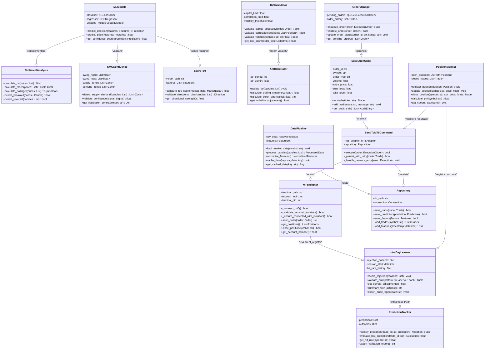

# Diagrama de Classes - Operador Day Trade WIN

**Data**: 03/03/2026
**Status**: ✅ COMPLETO
**Referência**: [ARCHITECTURE.md](ARCHITECTURE.md) | [MODELAGEM_DADOS.md](MODELAGEM_DADOS.md)

---

## 📊 Diagrama de Classes (Mermaid)



---

## 🏛️ Componentes Principais por Camada

### Data Layer 📥

| Classe | Responsabilidade | Localização |
|--------|-----------------|-------------|
| **MT5Adapter** | Interface com MetaTrader 5, validação de isolamento (3 camadas) | `src/infrastructure/providers/mt5_adapter.py` |
| **DataPipeline** | Processamento de candles, normalização de features | `src/data/pipeline.py` |
| **Repository** | Persistência em SQLite com pattern Repository | `src/data/repository.py` |

### Analysis Layer 🧠

| Classe | Responsabilidade | Localização |
|--------|-----------------|-------------|
| **MLModels** | Classificação (XGBoost), Regressão, Volatilidade | `src/ml/models.py` |
| **TechnicalAnalysis** | Indicadores técnicos (RSI, MACD, Bollinger) | `src/analysis/technical.py` |
| **SMCConfluence** | Smart Money Concepts, zonas de Supply/Demand | `src/analysis/smc_confluence.py` |
| **ScoreT60** | Previsão direcional T+60 com 24 features | `src/ml/score_t60.py` |

### Decision Layer 🎯

| Classe | Responsabilidade | Localização |
|--------|-----------------|-------------|
| **RiskValidator** | 3 gates de validação (Capital, Correlação, Volatilidade) | `src/application/risk_validator.py` |
| **ATRCalibrator** | Ajuste dinâmico Trailing Stop e Ticket Size | `src/application/atr_calibrator.py` |
| **OrderManager** | Fila de ordens, validação, status | `src/application/order_manager.py` |
| **PositionMonitor** | Monitoramento tempo real de posições | `src/application/position_monitor.py` |

### Execution Layer ⚡

| Classe | Responsabilidade | Localização |
|--------|-----------------|-------------|
| **ExecutionOrder** | Modelo de orden com auditoria | `src/domain/models/execution_order.py` |
| **SendToMT5Command** | Envio com retry logic (3x exponential backoff) | `src/application/orders_executor.py` |

### Learning Layer 🧠NEW

| Classe | Responsabilidade | Localização |
|--------|-----------------|-------------|
| **IntraDayLearner** | Aprendizado real-time de padrões (transparent mode) | `scripts/agente_micro_tendencia_winfut.py:2489-2618` |
| **PredictionTracker** | Validação de previsões vs outcome (P33 futura) | `src/application/services/ai_reflection_continuous.py` |

---

## 🔄 Fluxos de Interação

### Fluxo 1: Detecção → Execução

```
TechnicalAnalysis.detect_breakout()
    ↓
MLModels.predict_direction()
    ↓
SMCConfluence.validate_confluence()
    ↓
ScoreT60.compute_t60_score()
    ↓
RiskValidator.validate_*() [3 gates]
    ↓
OrderManager.enqueue_order()
    ↓
SendToMT5Command.execute()
    ↓
MT5Adapter.send_order() [com isolamento validado]
    ↓
PositionMonitor.register_position()
    ↓
IntraDayLearner.record_rejection() [se HOLD]
```

### Fluxo 2: Isolamento MT5 (3 Camadas)

```
Startup (Camada 1 - Pre-flight)
    ↓
MT5Adapter._preflight_check_mt5()
    └─ Valida path, testa conexão, verifica isolamento
    ↓
Connection (Camada 2 - Path Validation)
    ↓
MT5Adapter._validate_terminal_isolation()
    └─ os.path.isfile(), PID validation, account check
    ↓
Runtime (Camada 3 - Continuous Monitoring)
    ↓
A cada ~30s: mt5._validate_terminal_isolation()
    └─ Se falha → retry (5s, 10s, 20s) → HALT se definitivo
```

### Fluxo 3: Aprendizado Intraday (P32-P36)

```
Ciclo Principal [a cada 30s]:
    ↓
Rejeição → IntraDayLearner.record_rejection() [SILENCIOSO]
    ↓
Calcula hit_rate desde início sessão
    ↓
Se hit_rate > 80% → boost (+5%) [P35: aplica]
Se hit_rate < 40% → penalty (-10%) [P35: aplica]
    ↓
summary_with_actions() [APENAS se ação tomada]
    ↓
export_audit_log() [outputs/intraday_audit_{SESSION_ID}.log]
    ↓
[P33] PredictionTracker.evaluate_last_prediction()
    └─ Validação real vs simulação
    ↓
[P34] Persistência em SQLite
    └─ intraday_adjustments table
```

---

## 🔐 Constraints e Invariantes

### MT5 Isolamento
- ✅ **Invariante**: Terminal PID, account_login e server name devem ser constantes durante sessão
- ✅ **Validação**: A cada 30s em runtime monitoring
- ✅ **Falha**: HALT automático com log crítico

### Ordens e Trades
- ✅ **Invariante**: 1:1 mapeamento entre ExecutionOrder ↔ MT5 ticket
- ✅ **Invariante**: Cada Trade tem um decision_id linkado
- ✅ **Validação**: 3x retry logic com exponential backoff
- ✅ **Auditoria**: Completa em BD e outputs/

### Risco
- ✅ **Invariante**: Capital utilizado ≤ saldo disponível
- ✅ **Invariante**: Correlação entre posições ≤ 70%
- ✅ **Invariante**: Volatilidade ≤ 3-Sigma
- ✅ **Validação**: RiskValidator em 3 gates sequenciais

### Aprendizado Intraday
- ✅ **Invariante**: Mínimo 5 ocorrências de padrão antes de ajustar
- ✅ **Invariante**: Hit_rate calculado desde início sessão
- ✅ **Invariante**: Limite ±30% do threshold base
- ✅ **Validação**: A cada 5 ciclos (~150s)

---

## 📍 Referências Cruzadas

| Documento | Seção Relevante |
|-----------|-----------------|
| [ARCHITECTURE.md](ARCHITECTURE.md) | Componentes por camada (seções 1-7) |
| [REGRAS_NEGOCIO.md](REGRAS_NEGOCIO.md) | Políticas e limites de cada classe |
| [MODELAGEM_DADOS.md](MODELAGEM_DADOS.md) | Schema de persistência para cada classe |
| [DIAGRAMA_DADOS.md](DIAGRAMA_DADOS.md) | Relacionamentos entre tabelas |
| [ADRs.md](ADRs.md) | Decisões de design para cada componente |

---

## ⚡ Links Rápidos para Implementação

- **IntraDayLearner**: `scripts/agente_micro_tendencia_winfut.py` (linhas 2489-2618)
- **MT5Adapter isolamento**: `src/infrastructure/providers/mt5_adapter.py` (linhas 387-440 fix, linhas 3134+)
- **RiskValidator**: `src/application/risk_validator.py`
- **SendToMT5Command**: `src/application/orders_executor.py` (linhas 206-315)
- **Repository Pattern**: `src/data/repository.py` (usando SQLite)

---

**ÚLTIMA ATUALIZAÇÃO:** 03/03/2026 | **STATUS**: ✅ COMPLETO E REFERENCIADO
