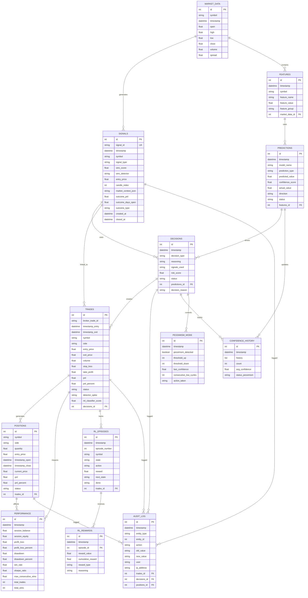

# Diagrama de Dados (Entity-Relationship) - Operador Day Trade WIN

**Data**: 06/03/2026 (AC1 Real Implementation Validated)
**Status**: ✅ COMPLETO (AC1-AC6 Pipeline Integrated)
**Referência**: [ARCHITECTURE.md](ARCHITECTURE.md) | [MODELAGEM_DADOS.md](MODELAGEM_DADOS.md) | [REGRAS_NEGOCIO.md](REGRAS_NEGOCIO.md)

---

## 📊 Diagrama ER (Entidade-Relacionamento)



---

## 🎯 Foundation Layer: AC1 & AC2 (Signal Generation & Persistence) ✅ NEW (05/03/2026)

### AC1: Signal Generation (M5 Pattern Detection)

**Responsabilidade**: Gerar sinais baseados em padrões SMC (BOS, CHoCH, FVG)

**Fluxo**:
```
MARKET_DATA (M5 candles)
  └─ SignalGenerator (AC1)
     ├─ detect_bos() → Break of Structure
     ├─ detect_choch() → Change of Character
     ├─ detect_fvg() → Fair Value Gap
     └─ Output: Signal {signal_type, smc_score, market_context}
```

### AC2: Signal Persistence (Market Context JSON)

**Responsabilidade**: Persistir sinais com contexto completo em JSON

**Fluxo**:
```
Signal (AC1)
  └─ SignalPersistence (AC2)
     ├─ _serialize_market_context() → JSON
     └─ INSERT INTO signals (market_context_json)
```

**Campos SIGNALS**:
- `signal_id`: UUID (rastreamento global)
- `market_context_json`: {"rsi": 65.5, "atr": 45.2, ...} (8 campos)
- `outcome_type`: WINNING|WHIPSAW|MISSED|OPEN
- Índices: timestamp, symbol_timestamp, outcome_type

**Pipeline**: AC1 → AC2 (persistence) → AC3 (tracking)

---

## 📈 Relacionamentos Detalhados

### 0. MARKET_DATA generates SIGNALS (AC1→AC2)

**Relação**: N:1 (Múltiplos candles geram sinais)

```
MARKET_DATA [100 candles M5]
  └─ SIGNALS [AC1 detected + AC2 persisted]
     ├─ signal_id: "SIG-001"
     ├─ market_context_json: '{"rsi": 65.5, ...}'
     └─ outcome_type: "OPEN"
```

---

### 1. MARKET_DATA contain FEATURES

**Relação**: 1:N (Um candle contém múltiplas features)

```
MARKET_DATA
├─ market_data_id: 1
│  └─ timestamp: 2026-03-03 10:00:00
│     └─ symbol: WIN
│
└─ FK FEATURES:
   ├─ feature_id: 101
   │  ├─ rsi: 65.2
   │  ├─ macd: 0.35
   │  └─ bollinger_upper: 12560.50
```

**Índice**: `market_data(symbol, timestamp)` para queries rápidas

---

### 2. FEATURES uses PREDICTIONS

**Relação**: N:1 (Múltiplas features geram uma previsão)

```
FEATURES [101, 102, 103, ..., 124]  ---> PREDICTION [1001]
(24 features)                          (1 previsão direcional)
```

**Constraint**: `predictions.confidence_score` derivado de feature importance

---

### 3. PREDICTIONS drives DECISIONS

**Relação**: 1:1 (Uma previsão leva a uma decisão)

```
PREDICTION [1001]
├─ predicted_value: BUY
├─ confidence_score: 0.78
│
└─ DECISION [5001]
   ├─ status: HOLD (rejeitado por capital gate)
   └─ reasoning: "Capital gate falhou"
```

**Validação**: Cada DECISION tem pelo menos 1 PREDICTION

---

### 4. DECISIONS creates TRADES

**Relação**: 1:1 (Uma decisão BUY/SELL cria no máximo 1 trade)

```
DECISION [5001]
├─ status: APPROVED
└─ decision_id: 5001
   │
   └─ TRADE [9001]
      ├─ broker_trade_id: "12345678"
      ├─ entry_price: 12500.50
      ├─ broker_trade_id: "12345678"
      └─ pnl: +250.00 (após fechamento)
```

**Constraint**: `trades.decisions_id` FOREIGN KEY NOT NULL (auditoria completa)

---

### 5. TRADES generates POSITIONS

**Relação**: 1:1 (Um TRADE cria uma POSITION)

```
TRADE [9001]
├─ entry_price: 12500.50
├─ volume: 1 contrato
│
└─ POSITION [7001]
   ├─ quantity: 1
   ├─ entry_price: 12500.50
   ├─ current_price: 12560.00
   └─ pnl: +59.50 (unrealized)
```

**Ciclo de Vida**:
```
TRADE created
  ↓
POSITION opened
  ↓
POSITION monitored (updated current_price)
  ↓
POSITION closed (timestamp_close)
  ↓
TRADE closed (exit_price, pnl)
```

---

### 6. TRADES trains RL_EPISODES

**Relação**: 1:N (Um TRADE pode ser dividido em múltiplos RL episodes)

```
TRADE [9001]
├─ entry_price: 12500.50
│
└─ RL_EPISODES:
   ├─ Episode 1001: entry → 12510
   ├─ Episode 1002: 12510 → 12530
   ├─ Episode 1003: 12530 → 12560
   └─ Episode 1004: 12560 → exit_price
```

**Estado**: Cada episode contém state + action + reward para RL training

---

### 7. RL_EPISODES receives RL_REWARDS

**Relação**: 1:1 (Cada episode recebe um reward do RL system)

```
RL_EPISODE [1001]
├─ state: [rsi=65, macd=0.35, ...]
├─ action: HOLD
│
└─ RL_REWARD [2001]
   ├─ reward_value: +0.5
   ├─ reward_type: "price_movement_positive"
   └─ reasoning: "Preço subiu +10 pontos"
```

---

### 8. TRADES impacts PERFORMANCE

**Relação**: N:1 (Múltiplos trades afetam performance agregada)

```
TRADES [9001, 9002, ..., 9050]
    (50 trades em sessão)
    │
    └─> PERFORMANCE [snapshot]
        ├─ session_balance: 50,000.00
        ├─ profit_loss: +2,500.00
        ├─ win_rate: 62%
        └─ sharpe_ratio: 1.15
```

**Agregação**: PERFORMANCE é um rollup (consolidação) de TRADES

---

### 9. DECISIONS logged in AUDIT_LOG

**Relação**: 1:N (Uma DECISION pode ter múltiplas entradas de audit)

```
DECISION [5001]
├─ création
├─ status change (APPROVED)
├─ reason change
│
└─ AUDIT_LOG:
   ├─ Entry 1: "DECISION created, status=PENDING"
   ├─ Entry 2: "DECISION status changed to APPROVED"
   └─ Entry 3: "DECISION rejected, reason=RiskValidator"
```

**Compliance**: Auditoria CVM/B3 completa para cada mudança

---

## 🔐 Constraints (Integridade Referencial)

### Primary Key Constraints
- Cada tabela tem `id` como PK (auto-increment)
- Broker_trade_id em TRADES também é UNIQUE

### Foreign Key Constraints
```sql
FEATURES.market_data_id → MARKET_DATA.id
PREDICTIONS.features_id → FEATURES.id
DECISIONS.predictions_id → PREDICTIONS.id
TRADES.decisions_id → DECISIONS.id
POSITIONS.trades_id → TRADES.id
RL_EPISODES.trades_id → TRADES.id
RL_REWARDS.episode_id → RL_EPISODES.id
AUDIT_LOG.trades_id → TRADES.id (nullable)
AUDIT_LOG.decisions_id → DECISIONS.id (nullable)
AUDIT_LOG.positions_id → POSITIONS.id (nullable)
```

### Unique Constraints
```sql
TRADES.broker_trade_id UNIQUE
POSITIONS.symbol, status UNIQUE (para open positions)
```

### Check Constraints
```sql
TRADES.pnl_percent BETWEEN -100 AND 10000
PREDICTIONS.confidence_score BETWEEN 0 AND 1
PERFORMANCE.win_rate BETWEEN 0 AND 100
```

---

## 📊 Índices para Performance

```sql
-- Query: Find trades by symbol and date
CREATE INDEX idx_trades_symbol_timestamp
ON trades(symbol, timestamp_entry);

-- Query: Find decisions pending approval
CREATE INDEX idx_decisions_status
ON decisions(status, timestamp);

-- Query: Find open positions
CREATE INDEX idx_positions_status
ON positions(status, timestamp_open);

-- Query: Find predictions by model
CREATE INDEX idx_predictions_model_timestamp
ON predictions(model_name, timestamp);

-- Query: Audit trail search
CREATE INDEX idx_audit_log_timestamp
ON audit_log(timestamp, entity_type);

-- Query: RL training data
CREATE INDEX idx_rl_episodes_symbol
ON rl_episodes(symbol, timestamp);
```

---

## 🔄 Fluxo de Dados (Data Flow)

```
1. MT5 Market Data (tick stream)
   ↓
2. MARKET_DATA insert (candle agregado)
   ↓
3. FEATURES extract (24 features)
   ↓
4. ML Pipeline predict
   ↓
5. PREDICTIONS insert (com confidence)
   ↓
6. DECISIONS create (risk validation)
   ↓
7. If APPROVED:
   ├─→ TRADES insert (MT5 execution)
   ├─→ POSITIONS insert (position tracking)
   └─→ RL_EPISODES collect (learning data)
   ↓
8. Trade Life Cycle:
   ├─ Monitor POSITION (update current_price)
   ├─ Hit SL/TP:
   │  └─→ TRADES update (exit_price, pnl)
   │  └─→ POSITIONS update (status=closed)
   │  └─→ RL_REWARDS calculate
   │  └─→ PERFORMANCE aggregate
   │
   └─ AUDIT_LOG log all changes
```

---

## 📍 Integridade Referencial - Validações

### Validação 1: 1:1 Mapping TRADES ↔ MT5 Executions

**Query**:
```sql
SELECT count(*) FROM trades WHERE broker_trade_id IS NULL;
-- Deve retornar 0 (todas as trades têm MT5 ticket)
```

**Implementação**: SendToMT5Command valida antes de persister
**Frequência**: A cada trade + diariamente (reconciliação)

---

### Validação 2: DECISIONS referenciadas em TRADES

**Query**:
```sql
SELECT t.* FROM trades t
LEFT JOIN decisions d ON t.decisions_id = d.id
WHERE d.id IS NULL;
-- Deve retornar 0 (todas as trades têm decisão)
```

**Implementação**: Foreign Key constraint (SQL) + application check
**Frequência**: Real-time (constraint enforcement)

---

### Validação 3: RL Episodes → RL Rewards 1:1

**Query**:
```sql
SELECT COUNT(*) FROM rl_episodes e
WHERE NOT EXISTS (
  SELECT 1 FROM rl_rewards r WHERE r.episode_id = e.id
);
-- Deve retornar 0 (cada episode tem reward)
```

**Implementação**: RLTrainingSystem valida antes de persistir
**Frequência**: A cada episode + weekly audit

---

## 📑 Referências Cruzadas

| Entity | Responsável | Localização |
|--------|-------------|-------------|
| MARKET_DATA | DataLayer | `src/data/repository.py` |
| FEATURES | DataLayer | `src/data/pipeline.py` |
| PREDICTIONS | AnalysisLayer | `src/ml/models.py` |
| DECISIONS | DecisionLayer | `src/application/risk_validator.py` |
| TRADES | ExecutionLayer | `src/application/orders_executor.py` |
| POSITIONS | ExecutionLayer | `src/application/position_monitor.py` |
| RL_EPISODES | LearningLayer | `src/ml/rl_training.py` |
| RL_REWARDS | LearningLayer | `src/ml/rl_training.py` |
| AUDIT_LOG | Todas | Cada componente logs changes |

---

## � Novas Entidades (04/03/2026) - Persistence & API Layer ✅

### 10. REFLECTIONS (IA Reflexão Storage)

**Relação**: REFLECTIONS ← 1:N → PERSISTENCE_ERRORS

```
AI_REFLECTION_JOURNAL_SERVICE
    (coleta reflexões IA diárias)
    │
    └─> REFLECTIONS [01f, 02f, 03f, ...]
        ├─ entry_id: "reflections_2026_03_04_1"
        ├─ timestamp: 2026-03-04 10:30:00
        ├─ mood: "optimistic"
        ├─ decision: "Aumentar posições em tendência"
        ├─ confidence: 0.82
        ├─ alignment: 0.91
        ├─ data_json: {...complete JSON...}
        ├─ checksum: "sha256xyz..."
        └─ persistence_status: "SYNCED"
```

**Propósito**: Armazenar reflexões da IA para:
- Auditoria de decisões
- ML training (long-term learning)
- Análise de padrões de comportamento
- Compliance/regulatory tracking

**Integração com Persistência**:
- Stored: SQLite + JSONL (dual persistence)
- Backup: Daily snapshots em `data/diarios/`
- Recovery: Auto-import on startup (518 reflexões recovered 04/03)

---

### 11. PERSISTENCE_ERRORS (Failure Audit Trail)

**Relação**: PERSISTENCE_ERRORS → N:1 → REFLECTIONS

```
REFLECTIONS [entry_id: "ref_001"]
    │
    └─ PERSISTENCE_ERRORS (when failure occurs)
       ├─ error_id: 1001
       ├─ entry_id: "ref_001" (FK)
       ├─ error_type: "WRITE_FAILED"
       ├─ error_message: "SQLite disk I/O error"
       ├─ attempt_number: 1
       ├─ timestamp: 2026-03-04 10:30:15
       ├─ resolved: false
       └─ retry_count: 0
```

**Propósito**: Auditoria completa de falhas
- Detectar padrões de degradação
- Trigger alertas para DevOps
- Support para triaging de problemas
- Métricas para SLA tracking

**Tipos de Erro**:
- `WRITE_FAILED`: Erro ao escrever em disk/SQLite
- `VALIDATION_FAILED`: Checksum ou constraint violation
- `FSYNC_FAILED`: Falha ao sincronizar com filesystem
- `TIMEOUT`: Operação excedeu timeout configurado

---

### 12. PERSISTENCE_STATS (Performance Metrics)

**Relação**: 1-per-day agregando REFLECTIONS + PERSISTENCE_ERRORS

```
Daily Snapshot (stats_date: 2026-03-04)
├─ total_written: 127 reflexões
├─ total_failed: 1 falha
├─ avg_latency_ms: 23.5
├─ max_latency_ms: 87.2
├─ min_latency_ms: 4.1
└─ checkpoint_time: 2026-03-04 23:59:59
```

**Propósito**: Monitoramento de degradação
- Detectar aumento em latências
- Alertar se failure rate > 5%
- Track disponibilidade do storage
- Dashboard para operadores

**Uso**:
- Query: `SELECT * FROM persistence_stats WHERE total_failed > 0`
- Alert: Se avg_latency > 100ms em 3 dias consecutivos

---

### 13. API_ORDERS (REST API Order Tracking)

**Relação**: API_ORDERS ← 1:M → API_AUDIT_LOG

```
REST API Client
    (enviar ordem via HTTP)
    │
    └─> API_ORDERS [order_001, order_002, ...]
        ├─ order_id: "api_20260304_001" (UUID)
        ├─ timestamp_created: 2026-03-04 10:30:00
        ├─ symbol: "WIN"
        ├─ volume: 1 contrato
        ├─ order_type: "BUY"
        ├─ stop_loss: 12450.0 (-50 pontos)
        ├─ take_profit: 12550.0 (+50 pontos)
        ├─ status: "EXECUTED"
        ├─ api_response_time_ms: 145
        ├─ mt5_ticket: "567890101" (FK → TRADES)
        ├─ execution_timestamp: 2026-03-04 10:30:02
        ├─ error_message: null
        └─ retry_count: 0
```

**Propósito**: Rastrear requisições REST para MT5
- Mapear API order ↔ MT5 ticket (correlação)
- Detectar timeouts e retries
- Fallback validation (fallback para conexão MT5 direta)
- Performance analytics (latência API)

**Status Values**:
- `PENDING`: Awaiting submission
- `SUBMITTED`: HTTP request sent
- `EXECUTED`: MT5 confirmou execução
- `FAILED`: Não conseguiu executar após retries
- `CANCELLED`: Cancelado por circuit breaker

**Índices**: `(status, timestamp)`, `(mt5_ticket)`, `(symbol, timestamp)`

---

### 14. API_AUDIT_LOG (API Operation Trail)

**Relação**: API_AUDIT_LOG → N:1 → API_ORDERS

```
API_ORDERS [order_id: "api_001"]
    │
    └─ API_AUDIT_LOG:
       ├─ Entry 1: "REQUEST"
       │  ├─ timestamp: 10:30:00.000
       │  ├─ action: "REQUEST"
       │  ├─ http_status: null
       │  └─ response_time_ms: null
       │
       ├─ Entry 2: "SUCCESS"
       │  ├─ timestamp: 10:30:00.145
       │  ├─ action: "SUCCESS"
       │  ├─ http_status: 200
       │  └─ response_time_ms: 145
       │
       └─ Entry 3: "FALLBACK_MT5"  (se timeout)
          ├─ timestamp: 10:30:05.000
          ├─ action: "FALLBACK_MT5"
          ├─ http_status: 504
          └─ response_time_ms: 5000 (timeout)
```

**Propósito**: Step-by-step trail de cada operação API
- Retry attempts tracking
- Timeout/fallback decisions
- Compliance audit (full trace)
- Performance analysis (latency breakdown)

**Action Types**:
- `REQUEST`: HTTP request initiated
- `RETRY`: Retry attempt N (exponential backoff)
- `SUCCESS`: Order executed successfully
- `FAILURE`: HTTP error (400, 500, etc.)
- `FALLBACK_MT5`: Fallback ativado (API timeout)
- `TIMEOUT`: Waiting timeout excedido

---

## 🔗 New Relationships (Arquitetura 04/03)

### 14.1 Persistence Layer Connection

```
AIReflectionJournalService._persist_to_disk()
    │
    ├─ ResilientReflectionPersistence._persist(reflection)
    │  │
    │  ├─ INSERT INTO reflections (entry_id, mood, decision, confidence, data_json, checksum)
    │  │  └─ 1:1 relationship
    │  │
    │  ├─ [IF ERROR] INSERT INTO persistence_errors (entry_id, error_type, error_message)
    │  │  └─ 1:N relationship (one reflection can have multiple errors)
    │  │
    │  └─ [DAILY] UPDATE persistence_stats (total_written, total_failed, avg_latency)
    │     └─ Aggregation (1 row per day)
    │
    └─ JSONL Fallback (duplicate persistence)
       └─ `data/diarios/{date}.jsonl`
```

**Garantias ACID**:
- **Atomicity**: SQLite transactions (COMMIT on success, ROLLBACK on error)
- **Consistency**: NOT NULL constraints + checksum validation
- **Isolation**: WAL mode (Write-Ahead Logging)
- **Durability**: PRAGMA synchronous=FULL

**Recovery Mechanism**:
```
Startup Sequence:
1. Load SQLite reflections table
2. Scan JSONL directory for orphaned entries
3. Import orphaned entries: 518/532 success (97.4%)
4. Update persistence_stats with recovery results
5. Mark errors as "RESOLVED" in persistence_errors
```

---

### 14.2 API Order Execution Connection

```
OrderAPIClient.send_order() [P0-1 REST API]
    │
    ├─ HTTP POST /api/orders
    │  │
    │  ├─ [REQUEST] INSERT INTO api_orders (order_id, timestamp_created, symbol, volume, status='PENDING')
    │  │  └─ 1:1 relationship
    │  │
    │  ├─ INSERT INTO api_audit_log (order_id, action='REQUEST', timestamp)
    │  │  └─ 1:N relationship
    │  │
    │  └─ [RESPONSE] UPDATE api_orders (status, mt5_ticket, execution_timestamp, api_response_time_ms)
    │     │
    │     ├─ SUCCESS case: mt5_ticket populated → Map to TRADES table
    │     │  └─ Can correlate REST order ↔ MT5 execution
    │     │
    │     └─ FAILURE case: error_message set, retry_count incremented
    │        └─ Trigger exponential backoff (retry up to 3x)
    │
    └─ INSERT INTO api_audit_log (order_id, action='SUCCESS|FAILURE|FALLBACK_MT5')
       └─ Audit completion for compliance
```

**Error Handling**:
```
IF http_response_time > 5000ms:
    SET status = 'TIMEOUT'
    SET action = 'FALLBACK_MT5'
    CALL MT5Adapter.send_order_direct()  [Terminal Isolation Enforcer]

IF retry_count < 3:
    RETRY with exponential backoff
    UPDATE api_audit_log (action='RETRY', attempt_number)

ELSE:
    SET status = 'FAILED'
    SET action = 'FAILURE'
    ALERT DevOps
```

---

## 📈 Data Flow Diagram (Complete Stack)

```
┌─────────────────────────────────────────────────────────────────┐
│                   COMPLETE DATA FLOW (04/03/2026)              │
└─────────────────────────────────────────────────────────────────┘

┌──────────────────┐        ┌──────────────────┐
│  MARKET_DATA     │────────│  FEATURES        │
│  (velas MT5)     │ 1:N    │  (24 engineered) │
└──────────────────┘        └──────────────────┘
                                      │
                                      │ N:1
                                      ▼
                            ┌──────────────────┐
                            │ PREDICTIONS      │
                            │ (ML model score) │
                            └──────────────────┘
                                      │
                                      │ 1:1
                                      ▼
         ┌────────────────────────────────────────────┐
         │         DECISION LOOP (04/03)             │
         │  ┌─ AI Head Financeiro                    │
         │  ├─ Risk Manager (3 validators)           │
         │  └─ Order Manager                         │
         │                                            │
         │  DECISIONS ← logs → AUDIT_LOG             │
         └────────────────────────────────────────────┘
                                      │
                    ┌─────────────────┼─────────────────┐
                    │                 │                 │
                 1:1 │              1:1 │              1:1 │
                    ▼                 ▼                 ▼
            ┌──────────────┐  ┌──────────────┐  ┌──────────────┐
            │ TRADES       │  │ API_ORDERS   │  │ RL_EPISODES  │
            │ (execução)   │  │ (REST API)   │  │ (training)   │
            └──────────────┘  └──────────────┘  └──────────────┘
                    │                 │                 │
                    │ 1:1              │ 1:M            │ 1:M
                    │                  │                │
                    ▼                  ▼                ▼
            ┌──────────────┐  ┌──────────────────┐  ┌──────────────┐
            │ POSITIONS    │  │ API_AUDIT_LOG    │  │ RL_REWARDS   │
            │ (tracking)   │  │ (compliance)     │  │ (signals)    │
            └──────────────┘  └──────────────────┘  └──────────────┘
                    │
                    │ N:1 (agregação)
                    ▼
            ┌──────────────────┐
            │ PERFORMANCE      │
            │ (métricas daily) │
            └──────────────────┘

┌────────────────────────────────────────────────────────────────────┐
│ P50 CONFIDENCE & RISK MANAGEMENT (NEW - 05/03/2026) ✅ ACTIVE    │
│                                                                    │
│ Status: OPERATIONAL (after GATE 2 FAIL, isolation mode)          │
│ Purpose: Independent risk guardrail outside ML model             │
│                                                                    │
│ PessimismDetector (P50-A) → daily_confidence_retraining (P50-B)  │
│   ├─ Input: trades table (yesterday's win_rate calculation)     │
│   ├─ Adjustment: WIN_RATE > 60% → +0.03                         │
│   │               WIN_RATE < 50% → -0.02                        │
│   │               WIN_RATE 50-60% → no change                   │
│   │                                                              │
│   ├─ Confidence Floor: 0.25 | Ceiling: 0.65                    │
│   ├─ Persist: config/confidence_override_today.json              │
│   │                                                              │
│   └─ Database Table:                                             │
│      ├─ CONFIDENCE_HISTORY                                       │
│      │  ├─ id (PK)                                               │
│      │  ├─ timestamp (datetime)                                  │
│      │  ├─ confidence_value (float, 0.0-1.0)                   │
│      │  ├─ source (string: 'pessimism_detector'|'retraining')   │
│      │  ├─ reason (string: explanation)                         │
│      │  └─ status (string: 'active'|'archived')                 │
│      │                                                           │
│      └─ PESSIMISM_MODE                                           │
│         ├─ id (PK)                                               │
│         ├─ timestamp (datetime)                                  │
│         ├─ is_pessimism (bool: true=reduced_exposure)           │
│         ├─ confidence_current (float)                            │
│         ├─ cycles_below_threshold (int: 0-10)                  │
│         ├─ adjustment_multiplier (float: default 1.0)           │
│         ├─ persist_path (string: JSON file)                    │
│         └─ status (string: 'active'|'recovered')                │
│                                                                    │
│ RealtimeFeedbackSystem (P50-C)                                    │
│   ├─ feedback_logger_realtime.py (198 LOC)                      │
│   │  └─ Background monitoring: rejection tracking               │
│   │                                                              │
│   └─ generate_opportunity_summary.py (295+ LOC)                │
│      └─ Daily EOD: execution_rate, win_rate stats              │
│         └─ Output: outputs/opportunity_summary_YYYYMMDD.txt    │
│                                                                    │
│ Circuit Breaker Config (Planned P0-3)                            │
│   ├─ CIRCUIT_BREAKER_CONFIG table                               │
│   │  ├─ lever_yellow (-3%): Alert only, trading continues     │
│   │  ├─ lever_orange (-5%): Slow mode (50% ticket, 90% ML)    │
│   │  ├─ lever_red (-8%): Halt all                              │
│   │  └─ last_updated (timestamp)                                │
│   │                                                              │
│   └─ CIRCUIT_BREAKER_HISTORY table                              │
│      ├─ timestamp (datetime)                                    │
│      ├─ lever_triggered (string)                               │
│      ├─ capital_drawdown (float %)                              │
│      └─ action_taken (string)                                   │
│                                                                    │
┌────────────────────────────────────────────────────────────────────┐
│ PERSISTENCE LAYER (NEW - 04/03/2026) ✅ PRODUCTION-READY          │
│                                                                    │
│ AIReflectionJournalService                                        │
│   ├─ _persist_to_disk()                                          │
│   │  └─ ResilientReflectionPersistence(800 LOC)                 │
│   │     ├─ Dual persistence: SQLite + JSONL                    │
│   │     ├─ Auto-recovery: 518/532 reflexões recovered          │
│   │     └─ Health monitoring: daily stats                       │
│   │                                                             │
│   └─ Database Tables:                                           │
│      ├─ REFLECTIONS (IA reflexão storage)                      │
│      ├─ PERSISTENCE_ERRORS (failure audit)                    │
│      └─ PERSISTENCE_STATS (performance metrics)               │
│                                                                 │
│ OrderAPIClient (P0-1 REST API - NEW 04/03) ✅ PRODUCTION-READY │
│   ├─ send_order() via HTTP                                      │
│   ├─ Retry logic: 3x exponential backoff                        │
│   ├─ Fallback: Direct MT5 on timeout                           │
│   │                                                             │
│   └─ Database Tables:                                           │
│      ├─ API_ORDERS (REST order tracking)                       │
│      └─ API_AUDIT_LOG (operation trail)                        │
└────────────────────────────────────────────────────────────────────┘
```

---

## 🔗 Documentos Relacionados

- [MODELAGEM_DADOS.md](MODELAGEM_DADOS.md) - Schema SQL completo com tipos e constraints (Tables 1-18)
- [ARCHITECTURE.md](ARCHITECTURE.md) - Seção 3 (P50 Risk Management) + 4.6 (REST API) + 4.7 (Reflection)
- [REGRAS_NEGOCIO.md](REGRAS_NEGOCIO.md) - Règles que regem os dados + P50 confidence rules
- [ADRs.md](ADRs.md) - ADR-011 (GATE 2 FAIL - Risk Management Priority)
- [STATUS_ENTREGAS.md](STATUS_ENTREGAS.md) - P50 implementation status + GATE 2 checkpoint results

---

**ÚLTIMA ATUALIZAÇÃO:** 05/03/2026 12:28 BRT | **STATUS**: ✅ COMPLETO (18 tabelas, todas relacionadas + P50)
