# Diagrama de Dados (Entity-Relationship) - Operador Day Trade WIN

**Data**: 03/03/2026
**Status**: ✅ COMPLETO
**Referência**: [ARCHITECTURE.md](ARCHITECTURE.md) | [MODELAGEM_DADOS.md](MODELAGEM_DADOS.md) | [REGRAS_NEGOCIO.md](REGRAS_NEGOCIO.md)

---

## 📊 Diagrama ER (Entidade-Relacionamento)

```mermaid
erDiagram
    MARKET_DATA ||--o{ FEATURES : contains
    FEATURES ||--o{ PREDICTIONS : uses
    PREDICTIONS ||--o{ DECISIONS : drives
    DECISIONS ||--o{ TRADES : creates
    TRADES ||--o{ POSITIONS : generates
    TRADES ||--o{ PERFORMANCE : impacts
    POSITIONS ||--o{ PERFORMANCE : affects
    TRADES ||--o{ RL_EPISODES : trains
    RL_EPISODES ||--o{ RL_REWARDS : receives
    DECISIONS ||--o{ AUDIT_LOG : logged
    TRADES ||--o{ AUDIT_LOG : logged
    POSITIONS ||--o{ AUDIT_LOG : logged

    MARKET_DATA {
        int id PK
        string symbol
        datetime timestamp
        float open
        float high
        float low
        float close
        float volume
        float spread
    }

    FEATURES {
        int id PK
        datetime timestamp
        string symbol
        string feature_name
        float feature_value
        string feature_group
        int market_data_id FK
    }

    PREDICTIONS {
        int id PK
        datetime timestamp
        string model_name
        string prediction_type
        float predicted_value
        float confidence_score
        float actual_value
        string direction
        string status
        int features_id FK
    }

    DECISIONS {
        int id PK
        datetime timestamp
        string decision_type
        string reasoning
        string signals_used
        float risk_score
        string status
        int predictions_id FK
        string decision_reason
    }

    TRADES {
        int id PK
        string broker_trade_id
        datetime timestamp_entry
        datetime timestamp_exit
        string symbol
        string side
        float entry_price
        float exit_price
        float volume
        float stop_loss
        float take_profit
        float pnl
        float pnl_percent
        string status
        string detector_spike
        float ml_classifier_score
        int decisions_id FK
    }

    POSITIONS {
        int id PK
        string symbol
        string side
        float quantity
        float entry_price
        datetime timestamp_open
        datetime timestamp_close
        float current_price
        float pnl
        float pnl_percent
        string status
        int trades_id FK
    }

    PERFORMANCE {
        int id PK
        datetime timestamp
        float session_balance
        float session_equity
        float profit_loss
        float profit_loss_percent
        float drawdown
        float drawdown_percent
        float win_rate
        float sharpe_ratio
        float max_consecutive_wins
        int total_trades
        int total_wins
    }

    RL_EPISODES {
        int id PK
        datetime timestamp
        int episode_number
        string symbol
        string state
        string action
        float reward
        string next_state
        string done
        int trades_id FK
    }

    RL_REWARDS {
        int id PK
        datetime timestamp
        int episode_id FK
        float reward_value
        float cumulative_reward
        string reward_type
        string reasoning
    }

    AUDIT_LOG {
        int id PK
        datetime timestamp
        string entity_type
        int entity_id
        string action
        string old_value
        string new_value
        string user
        string ip_address
        int trades_id FK
        int decisions_id FK
        int positions_id FK
    }
```



---

## 📈 Relacionamentos Detalhados

### 1. MARKET_DATA contain FEATURES

**Relação**: 1:N (Um candle contém múltiplas features)

```
MARKET_DATA
├─ market_data_id: 1
│  └─ timestamp: 2026-03-03 10:00:00
│     └─ symbol: WIN
│
└─ FK FEATURES:
   ├─ feature_id: 101
   │  ├─ rsi: 65.2
   │  ├─ macd: 0.35
   │  └─ bollinger_upper: 12560.50
```

**Índice**: `market_data(symbol, timestamp)` para queries rápidas

---

### 2. FEATURES uses PREDICTIONS

**Relação**: N:1 (Múltiplas features geram uma previsão)

```
FEATURES [101, 102, 103, ..., 124]  ---> PREDICTION [1001]
(24 features)                          (1 previsão direcional)
```

**Constraint**: `predictions.confidence_score` derivado de feature importance

---

### 3. PREDICTIONS drives DECISIONS

**Relação**: 1:1 (Uma previsão leva a uma decisão)

```
PREDICTION [1001]
├─ predicted_value: BUY
├─ confidence_score: 0.78
│
└─ DECISION [5001]
   ├─ status: HOLD (rejeitado por capital gate)
   └─ reasoning: "Capital gate falhou"
```

**Validação**: Cada DECISION tem pelo menos 1 PREDICTION

---

### 4. DECISIONS creates TRADES

**Relação**: 1:1 (Uma decisão BUY/SELL cria no máximo 1 trade)

```
DECISION [5001]
├─ status: APPROVED
└─ decision_id: 5001
   │
   └─ TRADE [9001]
      ├─ broker_trade_id: "12345678"
      ├─ entry_price: 12500.50
      ├─ broker_trade_id: "12345678"
      └─ pnl: +250.00 (após fechamento)
```

**Constraint**: `trades.decisions_id` FOREIGN KEY NOT NULL (auditoria completa)

---

### 5. TRADES generates POSITIONS

**Relação**: 1:1 (Um TRADE cria uma POSITION)

```
TRADE [9001]
├─ entry_price: 12500.50
├─ volume: 1 contrato
│
└─ POSITION [7001]
   ├─ quantity: 1
   ├─ entry_price: 12500.50
   ├─ current_price: 12560.00
   └─ pnl: +59.50 (unrealized)
```

**Ciclo de Vida**:
```
TRADE created
  ↓
POSITION opened
  ↓
POSITION monitored (updated current_price)
  ↓
POSITION closed (timestamp_close)
  ↓
TRADE closed (exit_price, pnl)
```

---

### 6. TRADES trains RL_EPISODES

**Relação**: 1:N (Um TRADE pode ser dividido em múltiplos RL episodes)

```
TRADE [9001]
├─ entry_price: 12500.50
│
└─ RL_EPISODES:
   ├─ Episode 1001: entry → 12510
   ├─ Episode 1002: 12510 → 12530
   ├─ Episode 1003: 12530 → 12560
   └─ Episode 1004: 12560 → exit_price
```

**Estado**: Cada episode contém state + action + reward para RL training

---

### 7. RL_EPISODES receives RL_REWARDS

**Relação**: 1:1 (Cada episode recebe um reward do RL system)

```
RL_EPISODE [1001]
├─ state: [rsi=65, macd=0.35, ...]
├─ action: HOLD
│
└─ RL_REWARD [2001]
   ├─ reward_value: +0.5
   ├─ reward_type: "price_movement_positive"
   └─ reasoning: "Preço subiu +10 pontos"
```

---

### 8. TRADES impacts PERFORMANCE

**Relação**: N:1 (Múltiplos trades afetam performance agregada)

```
TRADES [9001, 9002, ..., 9050]
    (50 trades em sessão)
    │
    └─> PERFORMANCE [snapshot]
        ├─ session_balance: 50,000.00
        ├─ profit_loss: +2,500.00
        ├─ win_rate: 62%
        └─ sharpe_ratio: 1.15
```

**Agregação**: PERFORMANCE é um rollup (consolidação) de TRADES

---

### 9. DECISIONS logged in AUDIT_LOG

**Relação**: 1:N (Uma DECISION pode ter múltiplas entradas de audit)

```
DECISION [5001]
├─ création
├─ status change (APPROVED)
├─ reason change
│
└─ AUDIT_LOG:
   ├─ Entry 1: "DECISION created, status=PENDING"
   ├─ Entry 2: "DECISION status changed to APPROVED"
   └─ Entry 3: "DECISION rejected, reason=RiskValidator"
```

**Compliance**: Auditoria CVM/B3 completa para cada mudança

---

## 🔐 Constraints (Integridade Referencial)

### Primary Key Constraints
- Cada tabela tem `id` como PK (auto-increment)
- Broker_trade_id em TRADES também é UNIQUE

### Foreign Key Constraints
```sql
FEATURES.market_data_id → MARKET_DATA.id
PREDICTIONS.features_id → FEATURES.id
DECISIONS.predictions_id → PREDICTIONS.id
TRADES.decisions_id → DECISIONS.id
POSITIONS.trades_id → TRADES.id
RL_EPISODES.trades_id → TRADES.id
RL_REWARDS.episode_id → RL_EPISODES.id
AUDIT_LOG.trades_id → TRADES.id (nullable)
AUDIT_LOG.decisions_id → DECISIONS.id (nullable)
AUDIT_LOG.positions_id → POSITIONS.id (nullable)
```

### Unique Constraints
```sql
TRADES.broker_trade_id UNIQUE
POSITIONS.symbol, status UNIQUE (para open positions)
```

### Check Constraints
```sql
TRADES.pnl_percent BETWEEN -100 AND 10000
PREDICTIONS.confidence_score BETWEEN 0 AND 1
PERFORMANCE.win_rate BETWEEN 0 AND 100
```

---

## 📊 Índices para Performance

```sql
-- Query: Find trades by symbol and date
CREATE INDEX idx_trades_symbol_timestamp
ON trades(symbol, timestamp_entry);

-- Query: Find decisions pending approval
CREATE INDEX idx_decisions_status
ON decisions(status, timestamp);

-- Query: Find open positions
CREATE INDEX idx_positions_status
ON positions(status, timestamp_open);

-- Query: Find predictions by model
CREATE INDEX idx_predictions_model_timestamp
ON predictions(model_name, timestamp);

-- Query: Audit trail search
CREATE INDEX idx_audit_log_timestamp
ON audit_log(timestamp, entity_type);

-- Query: RL training data
CREATE INDEX idx_rl_episodes_symbol
ON rl_episodes(symbol, timestamp);
```

---

## 🔄 Fluxo de Dados (Data Flow)

```
1. MT5 Market Data (tick stream)
   ↓
2. MARKET_DATA insert (candle agregado)
   ↓
3. FEATURES extract (24 features)
   ↓
4. ML Pipeline predict
   ↓
5. PREDICTIONS insert (com confidence)
   ↓
6. DECISIONS create (risk validation)
   ↓
7. If APPROVED:
   ├─→ TRADES insert (MT5 execution)
   ├─→ POSITIONS insert (position tracking)
   └─→ RL_EPISODES collect (learning data)
   ↓
8. Trade Life Cycle:
   ├─ Monitor POSITION (update current_price)
   ├─ Hit SL/TP:
   │  └─→ TRADES update (exit_price, pnl)
   │  └─→ POSITIONS update (status=closed)
   │  └─→ RL_REWARDS calculate
   │  └─→ PERFORMANCE aggregate
   │
   └─ AUDIT_LOG log all changes
```

---

## 📍 Integridade Referencial - Validações

### Validação 1: 1:1 Mapping TRADES ↔ MT5 Executions

**Query**:
```sql
SELECT count(*) FROM trades WHERE broker_trade_id IS NULL;
-- Deve retornar 0 (todas as trades têm MT5 ticket)
```

**Implementação**: SendToMT5Command valida antes de persister
**Frequência**: A cada trade + diariamente (reconciliação)

---

### Validação 2: DECISIONS referenciadas em TRADES

**Query**:
```sql
SELECT t.* FROM trades t
LEFT JOIN decisions d ON t.decisions_id = d.id
WHERE d.id IS NULL;
-- Deve retornar 0 (todas as trades têm decisão)
```

**Implementação**: Foreign Key constraint (SQL) + application check
**Frequência**: Real-time (constraint enforcement)

---

### Validação 3: RL Episodes → RL Rewards 1:1

**Query**:
```sql
SELECT COUNT(*) FROM rl_episodes e
WHERE NOT EXISTS (
  SELECT 1 FROM rl_rewards r WHERE r.episode_id = e.id
);
-- Deve retornar 0 (cada episode tem reward)
```

**Implementação**: RLTrainingSystem valida antes de persistir
**Frequência**: A cada episode + weekly audit

---

## 📑 Referências Cruzadas

| Entity | Responsável | Localização |
|--------|-------------|-------------|
| MARKET_DATA | DataLayer | `src/data/repository.py` |
| FEATURES | DataLayer | `src/data/pipeline.py` |
| PREDICTIONS | AnalysisLayer | `src/ml/models.py` |
| DECISIONS | DecisionLayer | `src/application/risk_validator.py` |
| TRADES | ExecutionLayer | `src/application/orders_executor.py` |
| POSITIONS | ExecutionLayer | `src/application/position_monitor.py` |
| RL_EPISODES | LearningLayer | `src/ml/rl_training.py` |
| RL_REWARDS | LearningLayer | `src/ml/rl_training.py` |
| AUDIT_LOG | Todas | Cada componente logs changes |

---

## 🔗 Documentos Relacionados

- [MODELAGEM_DADOS.md](MODELAGEM_DADOS.md) - Schema SQL completo com tipos e constraints
- [REGRAS_NEGOCIO.md](REGRAS_NEGOCIO.md) - Regras que regem os dados em cada entity
- [ADRs.md](ADRs.md) - Decisões sobre estrutura de dados

---

**ÚLTIMA ATUALIZAÇÃO:** 03/03/2026 | **STATUS**: ✅ COMPLETO
